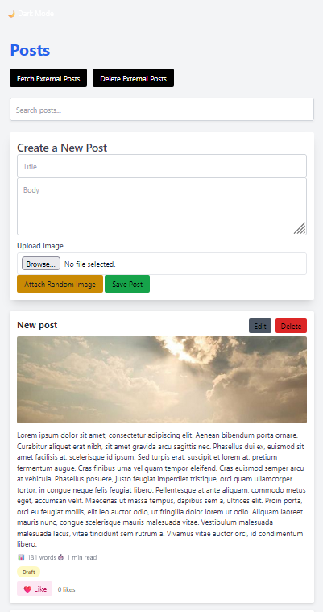

# Laravel Livewire Posts App 📝✨

A small **Laravel 10** project showcasing **Livewire** for reactive components, **Blade** templating, and **SQLite** database usage.  
You can create, edit, delete, and search posts in real time—no page refresh needed. Next, we will implement **API integration** to fetch and push posts, handling HTTP statuses like 200 ✅, 400 ⚠️, etc., making the app interact with modern external services. 🌐🚀

---

## Tech Stack

- **Laravel 10** – PHP framework
- **Livewire** – reactive frontend components
- **Blade** – templating engine
- **SQLite** – lightweight file-based database
- **Composer** – dependency management
- Optional: **DB Browser for SQLite** to inspect the database

---

## Features

- Create posts with **title**, **body**, and **status** (draft/published) ✏️
- Edit and delete posts inline 🛠️
- Live search filter for posts 🔍
- Reactive updates using Livewire events (no page refresh) ⚡
- Field validation for required fields and minimum lengths ✅
- **Planned:** API integration to fetch, update, and sync posts with external services 🌐

---

## 📸 Screenshots

### Posts List & Create Post



### Edit, Likes & Status Badges


## Installation

1. Clone this repository:

```bash
git clone <your-repo-url>


```
